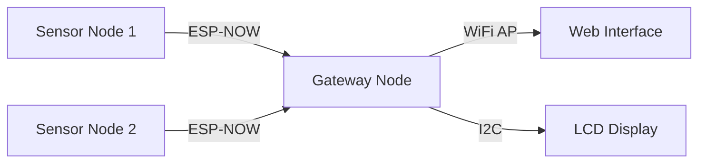

# 🧠 Distributed Edge AI Anomaly Detection

A predictive maintenance system that detects machinery faults (like bearing failures or rotor imbalances) using **TinyML** on ESP32 microcontrollers. It features distributed sensing, wireless communication, and an explainable AI (XAI) gateway.

## 🏗 System Architecture

The system consists of **Sensor Nodes** (Edge) and a central **Gateway** (Aggregator).



## ✨ Key Features

- **⚡ Edge Computing**: Runs a lightweight **Autoencoder Neural Network (8-4-8)** directly on the ESP32 to detect anomalies locally.
- **📡 Robust Communication**: Uses **ESP-NOW** for low-latency, peer-to-peer data transmission with automatic buffering during offline periods.
- **🧠 Explainable AI (XAI)**: The Gateway analyzes fault patterns (e.g., 120Hz vs 35Hz harmonics) to explain *why* a failure occurred.
- **🔄 Distributed System**: Supports multiple nodes monitoring different motors simultaneously.

## 📂 Project Structure

- `src/` - C++ Firmware for ESP32 (Sensor Nodes & Gateway).
- `ML-MODEL/` - Python scripts for training the Autoencoder (TensorFlow/Keras) and generating synthetic vibration datasets.
- `include/` - Header files and pin definitions.

## 🛠 Hardware Setup

| Device | Components | Role |
|--------|------------|------|
| **Sensor Node** | ESP32, MPU6050 (Accelerometer), DC Motor, LEDs | Collects vibration data, runs inference, controls motor. |
| **Gateway** | ESP32, LCD (16x2), OLED (Optional) | Aggregates status, displays alerts, hosts Web UI. |

## 🚀 Quick Start

1. **Train Model**:
   ```bash
   cd ML-MODEL/training
   python generate_dataset.py  # Create vibration data
   python train_autoencoder.py # Train & export weights
   ```

2. **Upload Gateway**:
   - Copy `src/main.cpp.gateway.new` to `src/main.cpp`
   - Run `pio run -t upload`

3. **Upload Sensor Node**:
   - Copy `src/main.cpp.sensor.backup` to `src/main.cpp`
   - Set `#define NODE_ID 1`
   - Run `pio run -t upload`

## 📊 Status

- [x] Data Generation & Model Training
- [x] ESP-NOW Wireless Mesh
- [x] Edge Inference Implementation
- [x] Gateway Web Interface & LCD
- [ ] Live Weight Import (Currently using simulated weights on device)

---
*Created for the Edge AI Anomaly Detection Project (2025)*
